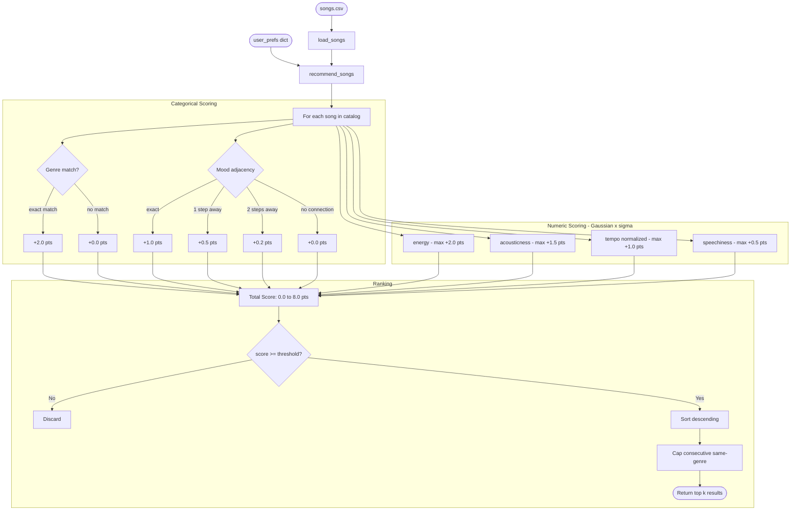

# 🎵 Music Recommender Simulation

## Project Summary

In this project you will build and explain a small music recommender system.

Your goal is to:

- Represent songs and a user "taste profile" as data
- Design a scoring rule that turns that data into recommendations
- Evaluate what your system gets right and wrong
- Reflect on how this mirrors real world AI recommenders

Replace this paragraph with your own summary of what your version does.

---

## How The System Works

Real-world music recommenders like Spotify work by converting songs and users into vectors of features, then finding songs whose vectors are closest to what the user has responded to before. This simulation follows the same idea at a smaller scale. Rather than treating every feature equally, this version prioritizes **vibe matching** — it uses mood as the primary signal (with adjacency instead of binary matching), then refines results using two derived axes: *texture* (how dense and electronic a song feels) and *activity level* (how much energy it demands from the listener). Scores are computed with a Gaussian proximity function so that songs slightly off-preference are penalized gently, and the tolerance window (σ) is tuned per user to handle niche or broad tastes.

### Song Features

| Feature | Type | Role in Scoring |
|---|---|---|
| `mood` | categorical | Primary vibe driver — adjacency-scored, not binary |
| `genre` | categorical | Soft bonus signal |
| `energy` | numeric (0–1) | Gaussian proximity to `target_energy` |
| `tempo_bpm` | numeric (60–152) | Gaussian proximity to `target_tempo_bpm` (normalized) |
| `acousticness` | numeric (0–1) | Gaussian proximity to `target_acousticness` |
| `speechiness` | numeric (0–1) | Gaussian proximity to `target_speechiness` |
| `instrumentalness` | numeric (0–1) | Stored on Song; informs future scoring extensions |

### Taste Profile (UserProfile / `user_prefs` dict)

The taste profile is a dictionary of target values the recommender scores each song against. It can be constructed manually or derived from a seed song.

```python
user1 = {
    "preferred_mood":     "intense",   # drives mood adjacency
    "preferred_genre":    "rock",      # drives genre bonus
    "target_energy":       0.93,       # Gaussian scored
    "target_tempo_bpm":    152,        # Gaussian scored (normalized)
    "target_acousticness": 0.10,       # Gaussian scored
    "target_speechiness":  0.06,       # Gaussian scored
    "sigma":               0.15        # tolerance window — tighter = pickier
}
```

### How a Score is Computed

Each song is scored on a **0 – 8.0 point scale**. Categorical features award fixed bonus points; numeric features use a Gaussian proximity function centered on the user's target value, scaled by `sigma`.

```
genre match       exact: +2.0  |  no match: +0.0
mood adjacency    exact: +1.0  |  1 step: +0.5  |  2 steps: +0.2  |  none: +0.0
energy            Gaussian(σ)  →  max +2.0
acousticness      Gaussian(σ)  →  max +1.5
tempo (norm.)     Gaussian(σ)  →  max +1.0
speechiness       Gaussian(σ)  →  max +0.5
                               ──────────────
                  Max total:        8.0 pts
```

**Mood adjacency map** (all 16 moods in catalog):
```
euphoric ── happy ── uplifted ── groovy
              │                     │
           relaxed ── romantic ── bittersweet
              │
           chill ── nostalgic ── peaceful
              │
           focused ── moody ── melancholic
              │          │
           intense ── dark ── angry
```

### System Sketch

```
[user_prefs dict] ──────────────────────────────┐
                                                 │
[songs.csv] ──► [load_songs()] ──► [Song list]  │
                                        │        │
                                        ▼        ▼
                                   [recommend_songs()]
                                        │
                                        │  for each song:
                                        │  score = Σ weighted feature proximity
                                        ▼
                                   [scored list]
                                        │
                                        ├─ drop score < 0.40
                                        ├─ sort descending
                                        ├─ cap consecutive same-genre
                                        └─ return top k results
```

### Algorithm Recipe



### Potential Biases

Because genre carries the single largest point bonus (+2.0), the recipe will consistently under-rank songs that are a strong emotional and sonic match but happen to sit in a different genre — a lofi user might never see an ambient song even though the two are nearly identical in energy, acousticness, and mood. Mood labels introduce a different kind of bias: "intense" scores the same whether it belongs to a rock track or an EDM drop, so the system cannot distinguish between those two very different listening experiences without genre doing extra work it was not designed for. Speechiness is effectively a dead feature for most profiles since every genre except hip-hop and trap clusters in the 0.02–0.07 range, meaning it rarely shifts a song's score in any meaningful direction. Finally, the catalog itself reflects a narrow cultural window — it covers Western genres almost exclusively, so any user whose taste gravitates toward Afrobeats, bossa nova, or K-pop will receive poor recommendations not because the algorithm fails, but because the data was never representative of their taste to begin with.

---

## Getting Started

### Setup

1. Create a virtual environment (optional but recommended):

   ```bash
   python -m venv .venv
   source .venv/bin/activate      # Mac or Linux
   .venv\Scripts\activate         # Windows

2. Install dependencies

```bash
pip install -r requirements.txt
```

3. Run the app:

```bash
python -m src.main
```

### Running Tests

Run the starter tests with:

```bash
pytest
```

You can add more tests in `tests/test_recommender.py`.

---

## Experiments You Tried

Use this section to document the experiments you ran. For example:

- What happened when you changed the weight on genre from 2.0 to 0.5
- What happened when you added tempo or valence to the score
- How did your system behave for different types of users

---

## Limitations and Risks

Summarize some limitations of your recommender.

Examples:

- It only works on a tiny catalog
- It does not understand lyrics or language
- It might over favor one genre or mood

You will go deeper on this in your model card.

---

## Reflection

Read and complete `model_card.md`:

[**Model Card**](model_card.md)

Write 1 to 2 paragraphs here about what you learned:

- about how recommenders turn data into predictions
- about where bias or unfairness could show up in systems like this


---

## 7. `model_card_template.md`

Combines reflection and model card framing from the Module 3 guidance. :contentReference[oaicite:2]{index=2}  

```markdown
# 🎧 Model Card - Music Recommender Simulation

## 1. Model Name

Give your recommender a name, for example:

> VibeFinder 1.0

---

## 2. Intended Use

- What is this system trying to do
- Who is it for

Example:

> This model suggests 3 to 5 songs from a small catalog based on a user's preferred genre, mood, and energy level. It is for classroom exploration only, not for real users.

---

## 3. How It Works (Short Explanation)

Describe your scoring logic in plain language.

- What features of each song does it consider
- What information about the user does it use
- How does it turn those into a number

Try to avoid code in this section, treat it like an explanation to a non programmer.

---

## 4. Data

Describe your dataset.

- How many songs are in `data/songs.csv`
- Did you add or remove any songs
- What kinds of genres or moods are represented
- Whose taste does this data mostly reflect

---

## 5. Strengths

Where does your recommender work well

You can think about:
- Situations where the top results "felt right"
- Particular user profiles it served well
- Simplicity or transparency benefits

---

## 6. Limitations and Bias

Where does your recommender struggle

Some prompts:
- Does it ignore some genres or moods
- Does it treat all users as if they have the same taste shape
- Is it biased toward high energy or one genre by default
- How could this be unfair if used in a real product

---

## 7. Evaluation

How did you check your system

Examples:
- You tried multiple user profiles and wrote down whether the results matched your expectations
- You compared your simulation to what a real app like Spotify or YouTube tends to recommend
- You wrote tests for your scoring logic

You do not need a numeric metric, but if you used one, explain what it measures.

---

## 8. Future Work

If you had more time, how would you improve this recommender

Examples:

- Add support for multiple users and "group vibe" recommendations
- Balance diversity of songs instead of always picking the closest match
- Use more features, like tempo ranges or lyric themes

---

## 9. Personal Reflection

A few sentences about what you learned:

- What surprised you about how your system behaved
- How did building this change how you think about real music recommenders
- Where do you think human judgment still matters, even if the model seems "smart"

